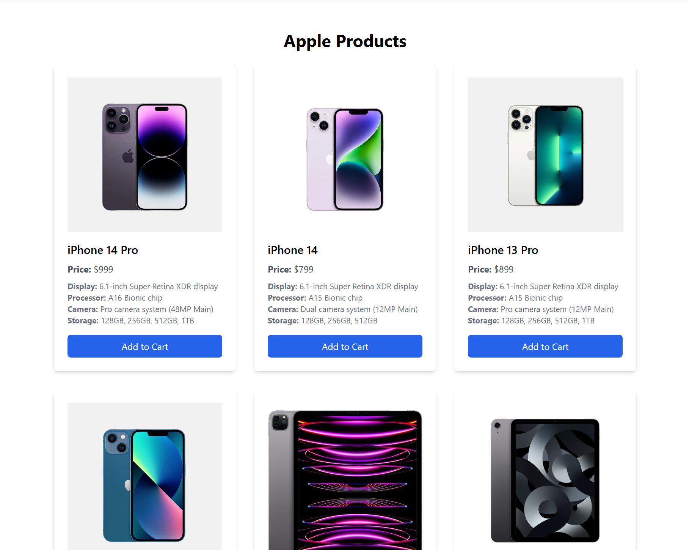
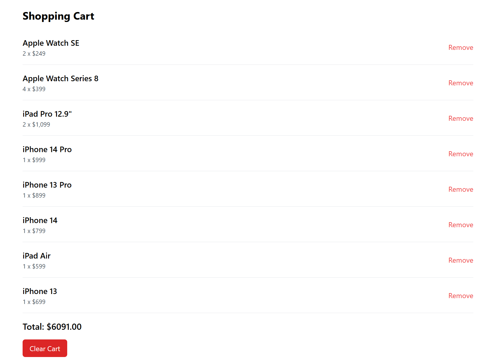

# E-Commerce Website

*Deployed on Netlify 😉*\
[](https://react-ecom-website-ahmmmyoo.netlify.app/)


This is a modern and minimalistic e-commerce website built using React, Vite, and Tailwind CSS. The project displays a list of Apple products (iPhones, iPads, and Watches) with their specifications, and allows users to add them to a shopping cart.

## Features

- **Product Display**: A variety of Apple products including iPhones, iPads, and Watches with their specifications.
- **Cart System**: Users can add products to their cart, update quantities, and remove products.
- **Responsive Design**: The site is responsive and works across different screen sizes, thanks to Tailwind CSS.

## Technologies Used

- [React](https://reactjs.org/) - Front-end JavaScript framework.
- [Vite](https://vitejs.dev/) - Fast build tool and development server.
- [Tailwind CSS](https://tailwindcss.com/) - Utility-first CSS framework for styling.
- [JavaScript (ES6+)](https://developer.mozilla.org/en-US/docs/Web/JavaScript) - Modern JavaScript features.
  
## Screenshots




## Getting Started

To get a local copy up and running, follow these steps:

### Prerequisites

Make sure you have the following installed on your local machine:

- [Node.js](https://nodejs.org/) (v14 or later)
- npm (Node package manager)

### Installation

1. **Clone the repository:**

   ```bash
   git clone https://github.com/Ahmmmyoo/react-Ecom-Website
   cd react-Ecom-Website
   ```

2. **Install dependencies:**

   ```bash
   npm install
   ```

3. **Run the development server:**

   ```bash
   npm run dev
   ```

   The app will run locally.

### Build for Production

To build the project for production, run:

```bash
npm run build
```

The optimized files will be outputted to the `dist` folder.

## Project Structure

```
src/
│
├── assets/         # React assets
│   ├── Header.jsx
│   ├── ProductsList.jsx
│   ├── Cart.jsx
│
├── data/               # Static data like products
│   └── products.js
│
├── App.jsx             # Main App component
└── index.jsx           # Entry point for the app
```

## Available Scripts

- **`npm run dev`**: Runs the development server.
- **`npm run build`**: Builds the project for production.
- **`npm run preview`**: Previews the built project.

## Contributing

Pull requests are welcome! If you have suggestions for improving this project, feel free to fork the repository and create a pull request.

1. Fork the Project.
2. Create your feature branch (`git checkout -b feature/AmazingFeature`).
3. Commit your changes (`git commit -m 'Add some AmazingFeature'`).
4. Push to the branch (`git push origin feature/AmazingFeature`).
5. Open a pull request.

## License

This project is licensed under the MIT License. See the [LICENSE](LICENSE) file for details.

## Acknowledgements

- React documentation: [React](https://reactjs.org/docs/getting-started.html)
- Vite documentation: [Vite](https://vitejs.dev/guide/)
- Tailwind CSS documentation: [Tailwind CSS](https://tailwindcss.com/docs)
